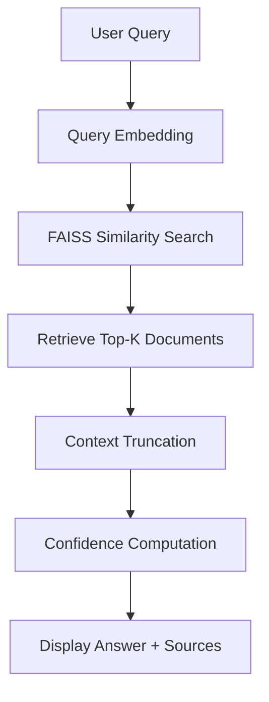

# Research Paper RAG Assistant

An end-to-end **Retrieval-Augmented Generation (RAG)** system built on real **arXiv research papers**, designed to answer user questions with **source attribution** and **confidence scoring**.

This project demonstrates how modern GenAI systems are built in practice by combining:

- Transformer-based embeddings
- Vector databases (FAISS)
- Retrieval-first reasoning
- Honest uncertainty estimation
- Lightweight deployment using Streamlit

---

## Live Demo

https://rag-research-assistant-pre-added.streamlit.app/

---

## Problem Statement

Large Language Models (LLMs) often **hallucinate** when answering questions, especially in technical domains like research papers.

This project addresses that problem by:

- Retrieving relevant research documents first
- Generating responses only from retrieved context
- Showing which paper was used
- Reporting a confidence score for transparency

---

## What This System Does

1. Accepts a natural language query
2. Performs semantic search on arXiv research papers
3. Retrieves the most relevant documents
4. Builds grounded context from retrieved papers
5. Displays:
   - Confidence score
   - Source paper title
   - arXiv category
   - Retrieved context

---

## Why RAG?

Traditional LLMs rely only on parametric memory and may hallucinate factual information.

RAG systems improve reliability by retrieving external knowledge before generating responses, enabling:

- Grounded generation
- Source attribution
- Factual consistency
- Explainable AI systems

---

## System Architecture

### High-Level Architecture

```text
User Query
↓
Sentence Transformer Embedding
↓
FAISS Vector Search
↓
Top-K Relevant Documents
↓
Context Construction
↓
Confidence Scoring + Source Attribution
↓
Streamlit UI Output
```

---

## Detailed RAG Pipeline Flow



This flow ensures the model never answers without first retrieving evidence.

---

## Dataset

**Source:** arXiv (Cornell University)

**Format:** JSON Lines (`.json`)

### Fields Used

- `title`
- `abstract`
- `categories`

Only abstracts are used to:

- Reduce noise
- Fit model context windows
- Improve retrieval precision

---

## Embedding Model

### Model Used

`all-MiniLM-L6-v2`

### Why This Model?

- Lightweight
- Strong semantic performance
- Industry-standard for RAG systems
- Fast inference speed

### Computation

- GPU (Tesla T4) used during embedding generation
- CPU used during inference and retrieval

---

## Vector Database (FAISS)

### Index Type

`IndexFlatIP`

### Similarity Metric

Cosine similarity (via normalized embeddings)

### Why FAISS?

- Extremely fast vector search
- Widely used in production RAG systems
- Scales efficiently to millions of embeddings

---

## Confidence Scoring

Confidence is derived from cosine similarity scores returned by FAISS.

```text
confidence (%) = average_similarity × 100
```

This allows the system to:

- Communicate uncertainty honestly
- Avoid overconfident hallucinations
- Build user trust

---

## Source Attribution

For every response, the system displays:

- Research paper title
- arXiv category
- Similarity score

This makes the system transparent and auditable.

---

## User Interface (Streamlit)

The Streamlit app provides:

- Natural language query input
- Confidence percentage
- Source paper details
- Retrieved context preview

Designed to be:

- Lightweight
- Fast
- Easy to deploy

---

## Example Questions

- What is diphoton production in particle physics?
- What are next-to-leading order contributions?
- How are photon pairs produced in hadron colliders?
- What kind of problems are studied in hep-ph research?

Out-of-scope questions correctly return low confidence or uncertainty.

---

## Example Retrieval

### Query

```text
What are next-to-leading order contributions?
```

### Retrieved Paper

```text
Next-to-leading order QCD corrections for diphoton production
```

### Confidence

```text
92.4%
```

---

## Tech Stack

- Python
- Sentence Transformers
- FAISS
- NumPy
- Streamlit
- Pickle
- arXiv Dataset

---

## Project Structure

```text
Research_Paper_RAG_Assistant/
│
├── app.py                 # Streamlit application
├── rag_utils.py           # Core RAG logic
├── faiss_index.bin        # FAISS vector index
├── data_bundle.pkl        # Documents and metadata
├── requirements.txt       # Dependencies
└── README.md              # Documentation
```

---

## Known Limitations

- Uses abstracts only, not full PDFs
- No reranking stage
- Conservative answer generation
- No fine-tuned LLM integration yet

These are intentional design choices for reliability and lightweight deployment.

---

## Future Improvements

- Full PDF ingestion and chunking
- Multi-document synthesis
- Better reranking pipelines
- Advanced answer generation models
- Evaluation dashboard (Precision@K)

---

## Skills Demonstrated

- Retrieval-Augmented Generation (RAG)
- Semantic Search
- Vector Databases (FAISS)
- Transformer Embeddings
- Explainable AI
- Confidence Estimation
- Streamlit Deployment
- GPU/CPU Workload Separation

---

## Deployment

- Streamlit Cloud for frontend deployment
- FAISS for semantic retrieval
- Sentence Transformers for embeddings
- CPU-optimized inference pipeline

---

## License

This project is intended for educational and portfolio purposes.

---

## Acknowledgements

- arXiv & Cornell University
- Hugging Face
- Facebook AI Research (FAISS)
- Streamlit

---

If you found this project useful, feel free to star the repository ⭐
